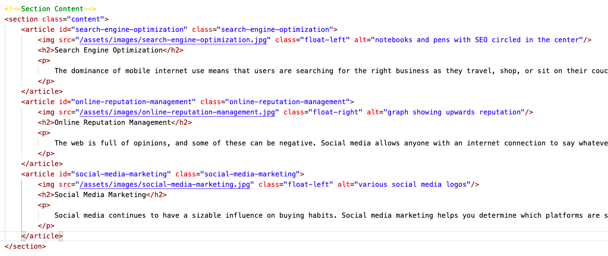

# Horiseon_H1 Revised

## Description

The goal of this project was to make the website more accessible to both users, and programmers if they decide to work on the code in the future. This was accomplished by implementing semantic HTML code that replaced the original "div soup" in the file. Furthermore, comments/alt tags were added, redudancies removed, and code was cleaned in order to add more structure. 

## Installation

To install the repository just follow your basic ssh clone procudure and use whichever text editor you like. It is completely up to you!

## Usage

If you wanted to add new articles instead of the ones already displayed in the section tag you can change them at your leisure to anything you like. 

## Changes made 

Some of the changes made to the original HTML include adding semantic HTML elements that seperate the file into body, header, section, aside, and footer instead of all tags being divs. 

I also condensed the CSS for many attributes because they were the same for all the images or paragraphs inside of a given container. For example, in the section tag the images all have the same formatting so instead of calling to each individual image, I called all the images in that section to have the same formatting. These kinds of changes reduced the amount of lines of code in CSS by 65 percent. 

## Credits 

I would like to thank my professor Lori and both my TA's. They were a tremendous help. 

## Tests to try

One thing that I would like to implement in the future is the use of flexbox instead of using floats in order to structure the images. That way in case any new images need to be used then you can add them with little effort instead of having to go back and change the floats inside the CSS.

## License

MIT License

Copyright (c) [2020] [Rafael Rosas]

Permission is hereby granted, free of charge, to any person obtaining a copy
of this software and associated documentation files (the "Software"), to deal
in the Software without restriction, including without limitation the rights
to use, copy, modify, merge, publish, distribute, sublicense, and/or sell
copies of the Software, and to permit persons to whom the Software is
furnished to do so, subject to the following conditions:

The above copyright notice and this permission notice shall be included in all
copies or substantial portions of the Software.

THE SOFTWARE IS PROVIDED "AS IS", WITHOUT WARRANTY OF ANY KIND, EXPRESS OR
IMPLIED, INCLUDING BUT NOT LIMITED TO THE WARRANTIES OF MERCHANTABILITY,
FITNESS FOR A PARTICULAR PURPOSE AND NONINFRINGEMENT. IN NO EVENT SHALL THE
AUTHORS OR COPYRIGHT HOLDERS BE LIABLE FOR ANY CLAIM, DAMAGES OR OTHER
LIABILITY, WHETHER IN AN ACTION OF CONTRACT, TORT OR OTHERWISE, ARISING FROM,
OUT OF OR IN CONNECTION WITH THE SOFTWARE OR THE USE OR OTHER DEALINGS IN THE
SOFTWARE.

